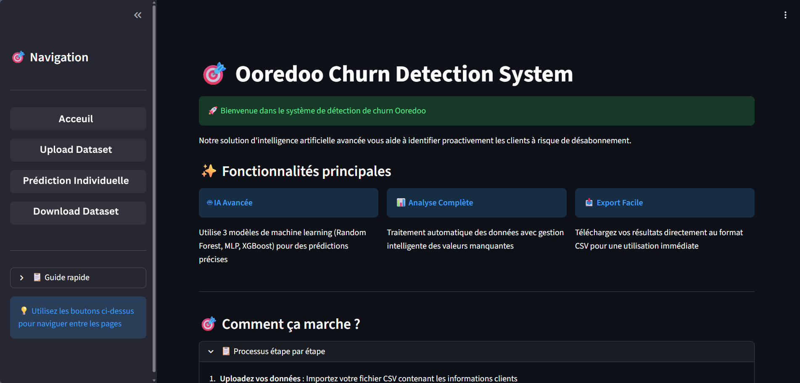
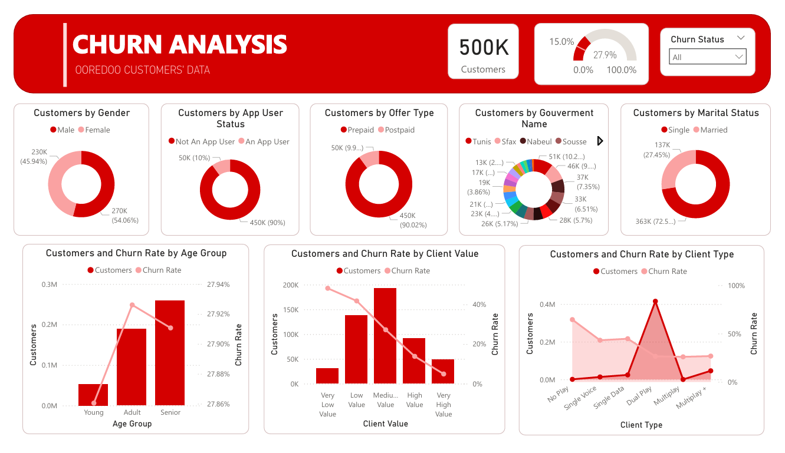

# 🎯 Customer Churn Prediction — Ooredoo Tunisia

> Predicting customer churn using Machine Learning on a 500K-row telecom dataset.

---

## 📌 Project Overview

This project builds and deploys a machine learning system to predict customer churn
for a telecom company. It includes data preprocessing, model training, performance 
evaluation, and an interactive Streamlit application for real-time predictions.

---

## 🚀 Demo

### Streamlit Application


### Power BI Dashboard


---

## 📊 Results

| Model | Accuracy | ROC AUC | F1-Score (Churn) |
|-------|----------|---------|------------------|
| XGBoost | **90%** | **0.937** | **0.80** |
| Random Forest | 88% | 0.918 | 0.76 |
| MLP | 87% | 0.910 | 0.75 |

✅ **Best model : XGBoost** with 90% accuracy and 0.937 ROC AUC

---

## 🛠️ Tech Stack

- **Language :** Python
- **ML Models :** XGBoost, Random Forest, MLP (Scikit-learn)
- **Data Processing :** Pandas, NumPy
- **Visualization :** Matplotlib, Seaborn, Power BI
- **Deployment :** Streamlit

---


## ⚙️ Installation

```bash
# Clone the repository
git clone https://github.com/HanineAttia/Churn-Prediction-of-ooredoo-clients.git

# Install dependencies
pip install -r requirements.txt
```

1. Open `Churn_Prediction.ipynb` in Google Colab or Jupyter Notebook
2. Run all cells sequentially
3. Once the Streamlit cell is executed, a **local URL** will appear (e.g. `http://localhost:8501`)
4. Click the link or open it in your browser to launch the app

---

## 👩‍💻 Author

**Hanine Attia**
Data Science Engineering Student at ESPRIT, Tunisia

[](https://linkedin.com/in/hanineattia)
[](https://github.com/HanineAttia)
